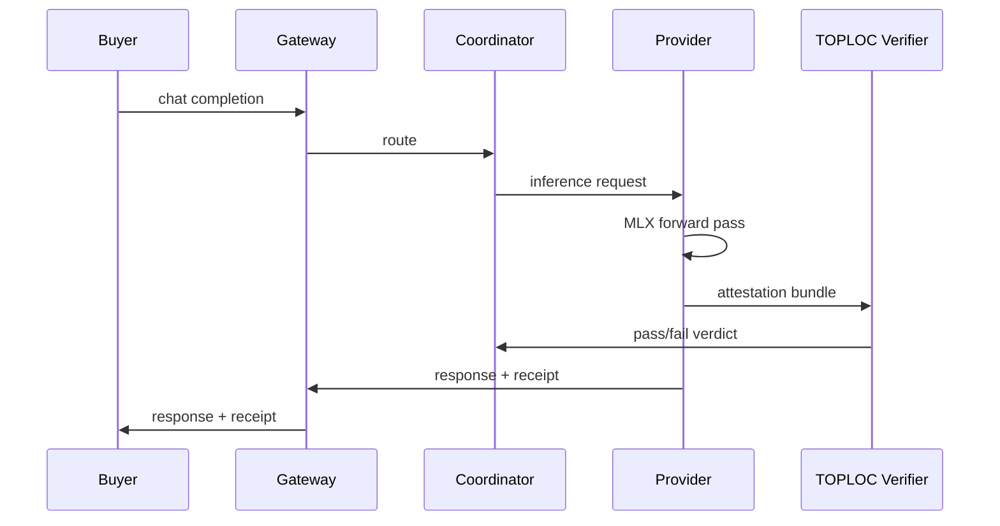

# TOPLOC integration

<Note>
  **Status: Planned v1** — not live in production routing or settlement. Signed receipts v0.3 are the live verification primitive today.
</Note>

> Per-request forward-pass attestation for buyer-paid inference. **Lineage:** TOPLOC (Prime Intellect, 2025).

TOPLOC closes the gap between "the provider signed this output" (receipt) and "this output came from an honest forward pass on the claimed weights" (forward-pass attestation). Malibu cites TOPLOC in the Litepaper as the v1 marketplace verification layer.

## What receipts do today vs what TOPLOC adds

| Question | Receipt v0.3 (live) | TOPLOC (planned v1) |
| --- | --- | --- |
| Did the provider sign this `(prompt, output)`? | Yes, if `valid` | Complementary |
| Was output produced by forward pass on catalog weights? | **Not proven** | **Design target** |
| Cost vs serving | Signature verify (~microseconds) | ~**1% of serving cost** (Prime Intellect estimate, cited in Litepaper) |

Do not describe live traffic as "TOPLOC-verified." Use [Security & trust model](/network/security) for current bounds.

## Planned architecture (high level)

Exact wire format and verifier placement will be documented here when integration ships. Expect:

- Verifier runs on attested weights aligned with catalog `model_hash`
- Failed attestation → settlement fault (same class as invalid receipt)
- Buyer-visible status distinct from receipt-only `valid`

## Failure modes (design-time)

| Failure | Expected handling |
| --- | --- |
| Verifier timeout | Treat as fault; zero provider credits; buyer refund path per settlement rules |
| Provider skips attestation | Non-settling response; routing penalty |
| Weight file drift | Catalog hash mismatch → already `invalid` at receipt layer |
| Verifier compromise | Coordinator-trusted component — threat model A5 applies |

## Cost and latency budget

Litepaper cites ~**1% of serving cost** for TOPLOC verification (Prime Intellect, 2025). Latency budget will be published with integration benchmarks on [Benchmarks & methodology](/network/benchmarks-and-methodology) when v1 ships.

## Lineage and credit

TOPLOC is **not** a Malibu invention. Malibu integrates it as the v1 buyer-response attestation layer. Research references live in the repo under `whitepaper/research/` when synced.

## Related

- [Threat model](/network/threat-model) — model-swap adversary A3
- [Receipts](/network/receipts) — live v0.3 primitive
- [Network status](/status) — TOPLOC row in verification table
- [Roadmap](/roadmap) — v1 marketplace milestone
